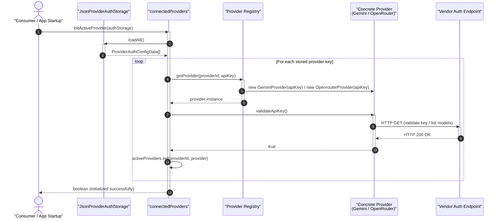
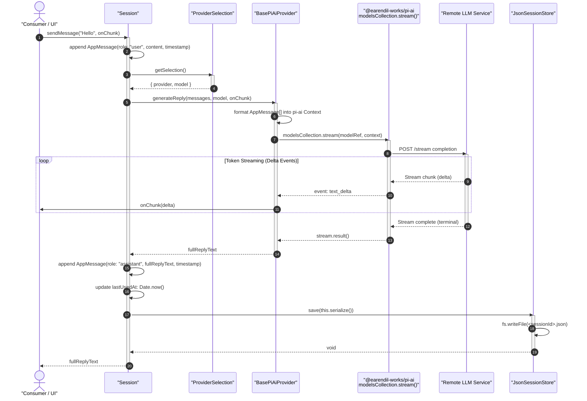
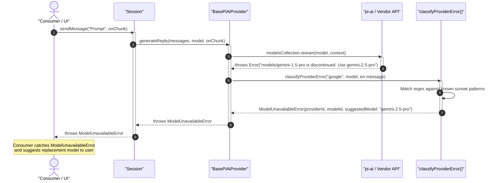
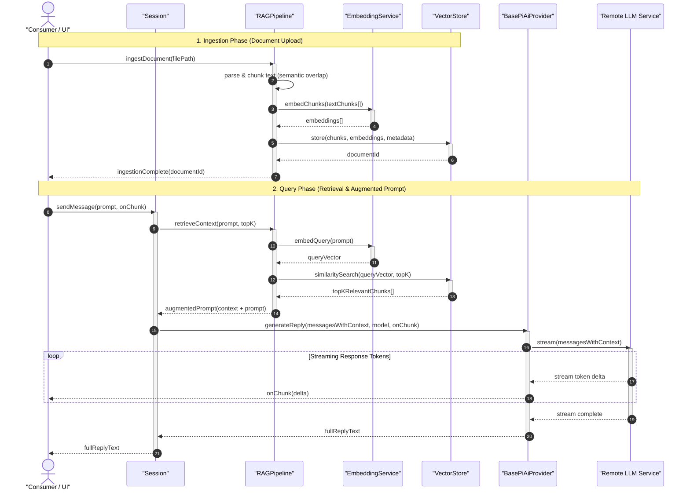
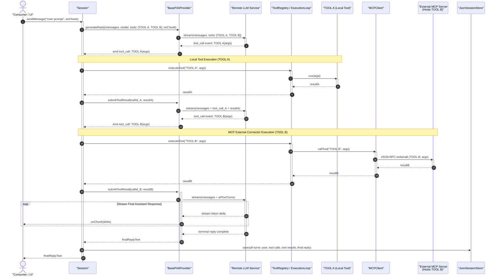
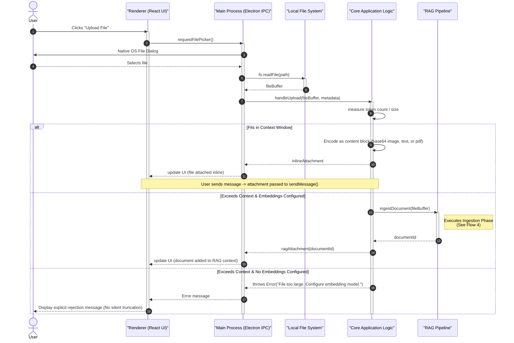

# LocoChat — Current Architecture Sequence Diagrams

This document illustrates the execution and data flow across LocoChat's layers in its current implementation.

---

## 1. System Layer Overview

LocoChat's current core engine operates across four primary boundaries:

1. **Consumer / Entry Layer:** The caller initiating operations (currently tests/services, future Electron IPC bridge).
2. **Session & Selection Layer:** [`Session`](../src/core/ai/session/session.ts), [`ProviderSelection`](../src/core/ai/providers/states/providerSelection.ts), and [`connectedProviders`](../src/core/ai/providers/states/connectedProviders.ts).
3. **Provider Abstraction Layer:** [`BasePiAiProvider`](../src/core/ai/providers/BasePiAiProvider.ts), [`classifyProviderError`](../src/core/ai/providers/errors.ts), and concrete implementations ([`GeminiProvider`](../src/core/ai/providers/gemini.ts), [`OpenrouterProvider`](../src/core/ai/providers/openrouter.ts)).
4. **Persistence Layer:** [`JsonProviderAuthStorage`](../src/core/ai/providers/repo/storage/jsonAuthStorage.ts) and [`JsonSessionStore`](../src/core/ai/session/repo/storage/jsonSessionStore.ts).

---

## 2. Flow 1: Provider Initialization & Key Validation

This flow demonstrates how credentials stored on disk are verified against external vendor APIs and loaded into active memory.

---

## 3. Flow 2: Conversation Turn, Hybrid Streaming & Persistence

This flow depicts what happens when a user sends a message. The token stream emits deltas to the caller in real-time, while the full response is awaited and saved atomically to disk.

---

## 4. Flow 3: Error Classification & Model Deprecation Handling

When an upstream vendor rejects a model (for instance, sunsetting Gemini 1.5 or missing routing), [`classifyProviderError`](../src/core/ai/providers/errors.ts) intercepts the failure and transforms it into a typed [`ModelUnavailableError`](../src/core/ai/providers/errors.ts).

---

## 5. Flow 4: RAG Pipeline (Ingestion & Context-Augmented Generation)

When uploaded documents exceed the inline context window, the application executes a two-phase RAG pipeline: offline/upload-time ingestion and query-time retrieval.

---

## 6. Flow 5: Tool Execution Loop (Local TOOL A & MCP TOOL B)

Illustrates the tool execution loop. The core handles both native local tools (`TOOL A`) and remote Model Context Protocol tools (`TOOL B`) through the same unified loop.

---

## 7. Flow 6: File & Photo Upload (Direct Inlining vs RAG)

This flow illustrates the file upload process, highlighting the core/skin separation. The React renderer requests a file, the Electron main process reads it from the filesystem, and the Core evaluates context constraints to decide between direct inlining or RAG ingestion.

